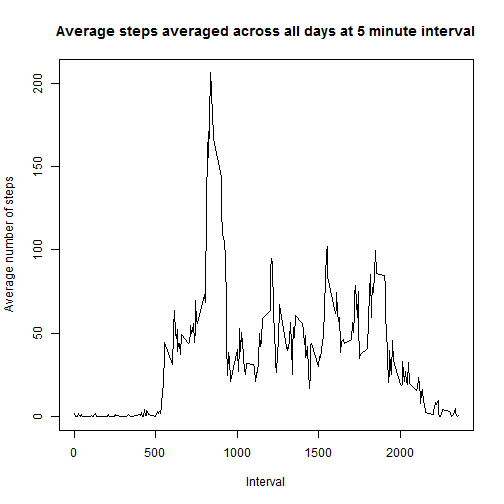
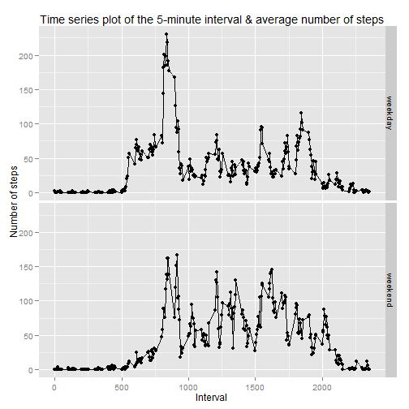

**Loading and processing the data**

```r
data <- read.csv("activity.csv", header= TRUE)
```

**What is the mean total number of steps taken per day?**

*1. Make a histogram of the total number of steps taken each day*


```r
hist_data <- aggregate(steps ~ date, data= data, sum, na.rm= TRUE)

hist(hist_data$steps, xlab = "Steps", ylab = "Frequency", main = "Total number of steps taken each day")
```

 

```r
data_na_rm <- subset(data, steps != "NA")
```

*2. Calculate and report the mean and median total number of steps taken per day*

The mean and median total number of steps taken per day is 


```r
mean_steps <- mean(hist_data$steps)
mean_steps
```

```
## [1] 10766.19
```

```r
median_steps <- median(hist_data$steps)
median_steps
```

```
## [1] 10765
```

**What is the average daily activity pattern?**

*1. Make a time series plot (i.e. type = "l") of the 5-minute interval (x-axis) and the average number of steps taken, averaged across all days (y-axis)*


```r
average_steps_interval <- aggregate(steps ~ interval, data= data, FUN= mean)

plot(average_steps_interval$interval, average_steps_interval$steps, type= "l", xlab="Interval", ylab= "Average number of steps")
title("Average steps averaged across all days at 5 minute interval")
```

 

*2.Which 5-minute interval, on average across all the days in the dataset, contains the maximum number of steps?*

The 5-minute interval that contains maximum number of steps is: 

```r
interval_with_max_steps <- subset(average_steps_interval, steps== max(steps), select = interval)
interval_with_max_steps
```

```
##     interval
## 104      835
```

**Imputing missing values**

*1. Calculate and report the total number of missing values in the dataset (i.e. the total number of rows with NAs)*

The total number of missing values is 

```r
total_missing_values <- sum(is.na(data$steps))
total_missing_values
```

```
## [1] 2304
```

*2.Devise a strategy for filling in all of the missing values in the dataset. The strategy does not need to be sophisticated. For example, you could use the mean/median for that day, or the mean for that 5-minute interval, etc.*

**Strategy:**
*The strategy to imput is to fill the NA values with the average steps for that interval*

*3.Create a new dataset that is equal to the original dataset but with the missing data filled in.*

*The code to imput the missing data using the strategy:*

```r
new_data <- data.frame(data)
new_data$steps <- replace(new_data$steps, is.na(new_data$steps), average_steps_interval$steps)
```

*4.Make a histogram of the total number of steps taken each day and Calculate and report the mean and median total number of steps taken per day. Do these values differ from the estimates from the first part of the assignment? What is the impact of imputing missing data on the estimates of the total daily number of steps?*


```r
hist_new_data <- aggregate(steps ~ date, data= new_data, sum, na.rm= TRUE)

hist(hist_new_data$steps, xlab = "Steps", ylab= "Frequency", main = "Total number of steps taken each day")
```

 

The mean and median total number of steps taken per day after replacing the NA values are:


```r
mean_new_data_steps <- mean(hist_new_data$steps)
mean_new_data_steps
```

```
## [1] 10766.19
```

```r
median_new_data_steps <- median(hist_new_data$steps)
median_new_data_steps
```

```
## [1] 10766.19
```

The mean steps is same as the one before imputting the NA values and the median is almost the same as the one before imputting the NA values. There is no impact on replacing the NA values with the average steps for that interval

**Are there differences in activity patterns between weekdays and weekends?**

*1.Create a new factor variable in the dataset with two levels "weekday" and "weekend" indicating whether a given date is a weekday or weekend day.*


```r
new_data$wkday_wkend <- weekdays(as.Date(new_data$date))

new_data[new_data== "Saturday"]= "weekend"
new_data[new_data== "Sunday"]= "weekend"
new_data[new_data== "Monday"]= "weekday"
new_data[new_data== "Tuesday"]= "weekday"
new_data[new_data== "Wednesday"]= "weekday"
new_data[new_data== "Thursday"]= "weekday"
new_data[new_data== "Friday"]= "weekday"
```

*2.Make a panel plot containing a time series plot (i.e. type = "l") of the 5-minute interval (x-axis) and the average number of steps taken, averaged across all weekday days or weekend days (y-axis). The plot should look something like the following, which was creating using simulated data:*


```r
average_newdata_steps_interval <- aggregate(steps ~ interval + wkday_wkend, data= new_data, FUN= mean)

library(ggplot2)

g<- qplot(average_newdata_steps_interval$interval, average_newdata_steps_interval$steps, data= average_newdata_steps_interval, facets= wkday_wkend~.)

g<- g + geom_line()

g<- g + labs(x= "Interval") + labs(y="Number of steps")

g<- g + labs(title = "Time series plot of the 5-minute interval & average number of steps")

g
```

 
